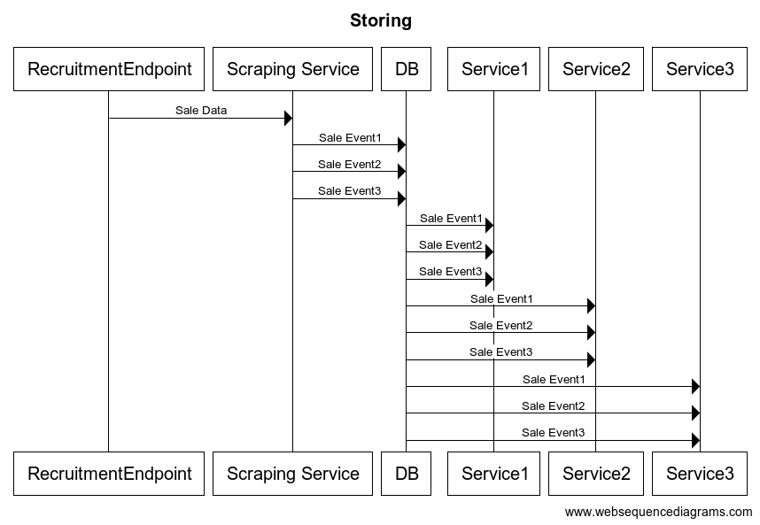

# Flip task
https://recruitment-api.dev.flipfit.io/orders?_page=%3Cpage%3E&_limit=%3Climit%3E

## Task 1

Implement EP TOP 10 profitable products, based on their sales value

quantity * product price

prices may change?

## Task 2

EP TOP 10 most often bought products

order count, not quantity

## Task 3 

EP TOP 10 most often bought products

order count, from yesterday

## Solution

1 service for most profitable products

    1 EP for most profitable

1 service for most often bought products (order count)

    1 EP for yesterday (date range parameter?)
    1 EP for everything


### Most profitable products

Starting out with no products

1. Product sold event 
    ```
    {
        "id": "e755f1b63cd8f72a2fa87dc0",
        "date": "2022-02-11T14:11:43.729Z",
        "customer": {
            "id": "8ffbde74a76d7ebcec6ce165",
            "name": "Fernando Quigley"
        },
        "items": [
            {
                "product": {
                    "id": "2cd9569bf9be776246a73f6b",
                    "name": "Tasty Metal Keyboard",
                    "price": "134.00"
                },
                "quantity": 1
            }
            ... other products
        ]
    }
    ```
2. Extract Product id, price, quantity, name (for readability)
```
    for each product
    totalSold = price * quantity
```
3. Upsert into database id, totalSold
    1. If no id, save as [id, totalSold]
    2. If exists id, save as [id, totalSoldInDb + totalSold]

This way the changing price is a non-issue since they are calculated as a total

If we want to return TOP 10 we just scan the db and sort them by largest `totalSold` and get 10

We can also keep it as a running total in cache or in memory and update it everytime new event arrives.


### Most often bought products ever (order count)

Starting out with no products

1. Product sold event 
    ```
    {
        "id": "e755f1b63cd8f72a2fa87dc0",
        "date": "2022-02-11T14:11:43.729Z",
        "customer": {
            "id": "8ffbde74a76d7ebcec6ce165",
            "name": "Fernando Quigley"
        },
        "items": [
            {
                "product": {
                    "id": "2cd9569bf9be776246a73f6b",
                    "name": "Tasty Metal Keyboard",
                    "price": "134.00"
                },
                "quantity": 1
            }
            ... other products
        ]
    }
    ```
2. Extract product id, name (for readability)
3. Upsert into database id, totalOrders
    1. If no id, save as [id, 1]
    2. If exists id, save as [id, totalOrdersInDb + 1]


We keep a running total

### Most often bought products yesterday (order count)

1. Product sold event 
    ```
    {
        "id": "e755f1b63cd8f72a2fa87dc0",
        "date": "2022-02-11T14:11:43.729Z",
        "customer": {
            "id": "8ffbde74a76d7ebcec6ce165",
            "name": "Fernando Quigley"
        },
        "items": [
            {
                "product": {
                    "id": "2cd9569bf9be776246a73f6b",
                    "name": "Tasty Metal Keyboard",
                    "price": "134.00"
                },
                "quantity": 1
            }
            ... other products
        ]
    }
    ```
2. Extract product id, date, name (for readability)
3. Upsert into database id, date, totalOrders
    1. If no id, save as [id, date, 1]
    2. If exists id, save as [id, date, totalOrdersInDb + 1]


Assuming all dates are in the same timezone

We extract the day and id and store a rolling total for each product for each day


### Scraping service

Get all the sales page by page and store them (?)

Store them in db, whenever a new service wants to startup they can use this service to send them the events


### Messaging service

Since this is should be event-driven, a messaging service should be used for transporting events

~~i will use rabbitMQ since i have experience using it~~

Did some googling and decided i will use kafka since it is made for storing large amounts of event data

Scraping service will publish each event to kafka

Every service will connect to kafka and read the events stored there everytime service is started, then do the processing as described above

I have never used kafka so we will see how it goes

## Diagram

### Storing events
```
title Storing 

RecruitmentEndpoint -> Scraping Service: Sale Data
Scraping Service -> Kafka: Sale Event1
Scraping Service -> Kafka: Sale Event2
Scraping Service -> Kafka: Sale Event3
Kafka -> Service1: Sale Event1
Kafka -> Service1: Sale Event2
Kafka -> Service1: Sale Event3
Kafka -> Service2: Sale Event1
Kafka -> Service2: Sale Event2
Kafka -> Service2: Sale Event3
Kafka -> Service3: Sale Event1
Kafka -> Service3: Sale Event2
Kafka -> Service3: Sale Event3
```

